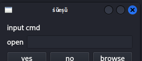

视频教程：[QT快速入门 | 最简单最简洁的QT入门教程 | 嵌入式UI](https://www.bilibili.com/video/BV1N34y1H7x7/?share_source=copy_web&vd_source=dd23e37f34be8abeabaf405e07d31ab0) 


# Qt概述

Qt官网：https://www.qt.io/development/download-open-source

Qt是一个跨平台的C艹图形用户界面应用程序开发框架。

跟 STL 一样，这玩意也是一个库，就是用途不一样。


## Qt的用处

- 嵌入式设备（图形显示）
- 桌面应用

## Qt的编译过程

- 编写源代码
- 修改环境变量
- 生成工程文件
- 生成makefile
- 编译工程

### eg. 以一次使用记事本开发为例

- qmake生成工程文件

  使用记事本输入下列程序：

  ```cpp
  // qtest.cpp
  #include<QApplication>
  #include<QLabel>
  #include<QPushButton>
  #include<QLineEdit>
  #include<QHBoxLayout>
  #include<QVBoxLayout>
  #include<QWidget>
  
  int main(int arge,char* argv[]){
    
    QApplication app(arge,argv);
    
    QLabel *infoLable = new QLabel;
    QLabel *openLable = new QLabel;
    
    QLineEdit *cmdLineEdit = new QLineEdit;
  
    QPushButton *commitButton = new QPushButton;
    QPushButton *cancelButton = new QPushButton;
    QPushButton *browseButton = new QPushButton;
  
    infoLable -> setText("input cmd");
    openLable -> setText("open");
  
    commitButton -> setText("yes");
    cancelButton -> setText("no");
  
    browseButton -> setText("browse");
  
    
    QHBoxLayout* cmdLayout = new QHBoxLayout;
    cmdLayout -> addWidget(openLable);
    cmdLayout -> addWidget(cmdLineEdit);
  
    QHBoxLayout* buttonLayout = new QHBoxLayout;
    buttonLayout -> addWidget(commitButton);
    buttonLayout -> addWidget(cancelButton);
    buttonLayout -> addWidget(browseButton);
  
    QVBoxLayout* mainLayout = new QVBoxLayout;
    mainLayout -> addWidget(infoLable);
    mainLayout -> addLayout(cmdLayout);
    mainLayout -> addLayout(buttonLayout);
  
    QWidget w;
    w.setLayout(mainLayout);
    w.show();
    
    return app.exec();
  }
  ```

  然后执行下面的命令：

  ```bash
  qmake -project
  ```

  可以得到 `qtest.pro` 文件：

  ```shell
  ┌──(kali㉿kali-vbox)-[~/learnCS/learnQt/qtest]
  └─$ ll
  total 8.0K
  -rw-rw-r-- 1 kali kali 1.2K Mar  5 21:17 qtest.cpp
  -rw-rw-r-- 1 kali kali  707 Mar  5 21:18 qtest.pro
  ```

  然后将 `qtest.pro`  改为如下内容：

  ```
  ######################################################################
  # Automatically generated by qmake (3.1) Thu Mar 5 21:18:26 2026
  ######################################################################
  
  TEMPLATE = app
  TARGET = qtest
  INCLUDEPATH += .
  
  # You can make your code fail to compile if you use deprecated APIs.
  # In order to do so, uncomment the following line.
  # Please consult the documentation of the deprecated API in order to know
  # how to port your code away from it.
  # You can also select to disable deprecated APIs only up to a certain version of Qt.
  #DEFINES += QT_DISABLE_DEPRECATED_BEFORE=0x060000    # disables all the APIs deprecated before Qt 6.0.0
  
  # Input
  SOURCES += qtest.cpp
  
  QT += widgets gui
  ```

- qmake生成makefile

  ```shell
  ┌──(kali㉿kali-vbox)-[~/learnCS/learnQt/qtest]
  └─$ la
  total 36K
  -rw-rw-r-- 1 kali kali  21K Mar  5 21:29 Makefile
  -rw-rw-r-- 1 kali kali  693 Mar  5 21:29 .qmake.stash
  -rw-rw-r-- 1 kali kali 1.2K Mar  5 21:17 qtest.cpp
  -rw-rw-r-- 1 kali kali  726 Mar  5 21:24 qtest.pro
  ```

  可见这里生成了MakeFile

  然后 `make` 就行了。

  运行可以得到一个窗口：

  


